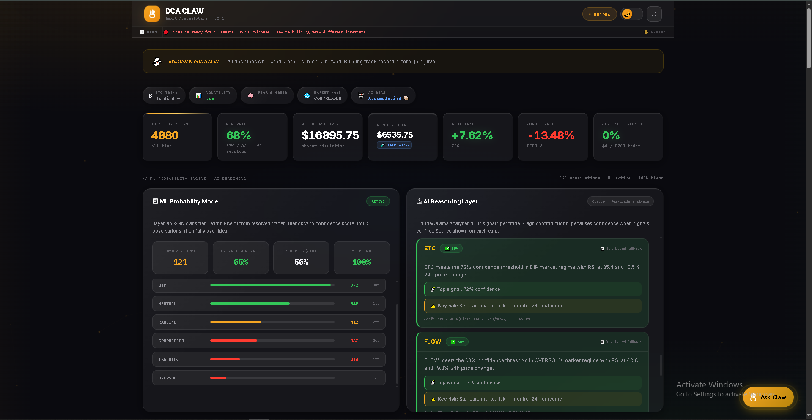
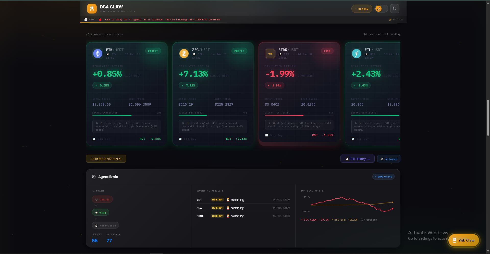
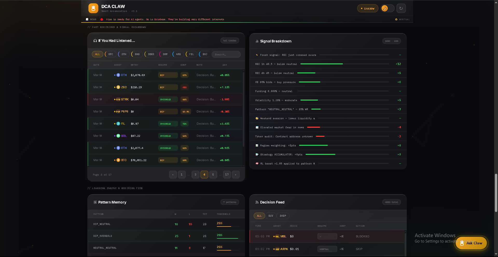
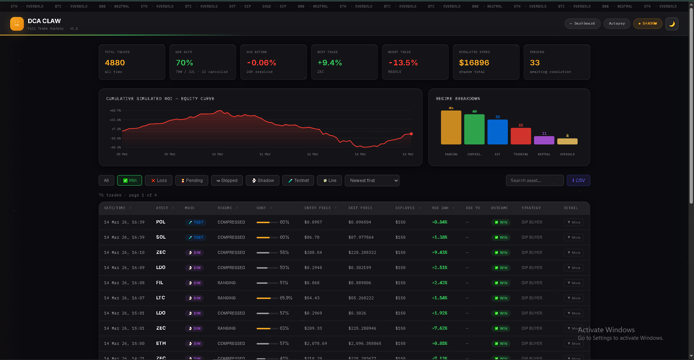

# 🦞 DCA CLAW v3.2

### Autonomous AI-powered Dollar Cost Averaging agent for Binance
**Built for the Binance "Build the Future with AI Claw" Contest 2026**
*by Samuel Oduntan (@Aureneaux)*

---

> DCA Claw watches the market 24/7, scores every major crypto asset through a 16-signal engine, uses machine learning to predict win probability, runs an AI reasoning layer powered by Claude, and automatically places DCA buy orders when conditions align — all while sending you clean Telegram notifications and learning from every trade it makes.

---

## Table of Contents

1. [What DCA Claw Does](#what-dca-claw-does)
2. [Requirements](#requirements)
3. [Installation — Step by Step](#installation--step-by-step)
4. [Configuration — Your .env File](#configuration--your-env-file)
5. [Getting Your API Keys](#getting-your-api-keys)
   - Binance Testnet API
   - Binance Live API
   - Telegram Bot Token
   - Anthropic API Key (optional)
6. [Running the Agent](#running-the-agent)
7. [Telegram Commands](#telegram-commands)
8. [Understanding the Three Modes](#understanding-the-three-modes)
9. [How the Intelligence Works](#how-the-intelligence-works)
10. [Risk Settings Explained](#risk-settings-explained)
11. [Going Live — Checklist](#going-live--checklist)
12. [The Dashboard](#the-dashboard)
13. [File Structure](#file-structure)
14. [Troubleshooting](#troubleshooting)
15. [FAQ](#faq)

---

## What DCA Claw Does

Every time a cycle runs (every 30 minutes by default, you can change this), the agent:

1. **Scans** the entire Binance market — up to 3,500+ trading pairs
2. **Filters** down to the best candidates (volume, liquidity, safety checks)
3. **Scores** each asset through 16 independent signals
4. **Predicts** win probability using a Bayesian ML model trained on your own trade history
5. **Reasons** about each signal using Claude AI — flags contradictions, generates plain-English rationale
6. **Checks** the bid-ask spread and estimated slippage before committing to a size
7. **Sizes** each position using ATR volatility + Kelly criterion
8. **Decides** — buy, skip, or block based on portfolio heat, sector caps, and market regime
9. **Notifies** you on Telegram with the full breakdown
10. **Learns** from every resolved trade, updating weights, patterns, and ML model

It runs in three modes: **Shadow** (paper trading, always on, no real money), **Testnet** (real Binance infrastructure, fake money), and **Live** (real money, real orders).

---

## Requirements

Before you install anything, make sure you have:

| Requirement | Minimum Version | How to Check |
|---|---|---|
| Node.js | v18 or higher | `node --version` |
| npm | v8 or higher | `npm --version` |
| A Telegram account | Any | — |
| A Binance account | Any | — |
| Internet connection | Stable | — |

> **If you don't have Node.js:** Download it from [nodejs.org](https://nodejs.org) — install the LTS version. It includes npm automatically.

---

## Installation — Step by Step

### Step 1 — Download the project

Put the entire `DCA_Claw_v3` folder somewhere on your computer. For example:

- Windows: `C:\Users\YourName\Desktop\DCA_Claw_v3\`
- Mac/Linux: `~/Desktop/DCA_Claw_v3/`

### Step 2 — Open a terminal in that folder

**Windows:**
- Open File Explorer, navigate to the folder
- Click the address bar at the top, type `cmd`, press Enter
- A black terminal window opens in that folder

**Mac:**
- Right-click the folder in Finder
- Click "New Terminal at Folder"

**Linux:**
- Right-click in the folder → "Open Terminal"

### Step 3 — Install dependencies

In the terminal, type this and press Enter:

```bash
npm install
```

You will see a lot of text scroll by. This is normal. Wait until it finishes and you see your cursor again. This downloads all the libraries the agent needs.

### Step 4 — Create your .env file

In the project folder, create a new file called exactly `.env` (with the dot, no other extension).

> **Windows tip:** Open Notepad. File → Save As → navigate to the project folder → in "File name" type `.env` → in "Save as type" choose "All Files" → Save.

Paste this into the file:

```env
# ── Telegram ─────────────────────────────────────────────────────
TELEGRAM_BOT_TOKEN=your_telegram_bot_token_here
TELEGRAM_CHAT_ID=your_telegram_chat_id_here

# ── Binance (start with testnet — change to live when ready) ─────
BINANCE_API_KEY=your_binance_api_key_here
BINANCE_API_SECRET=your_binance_api_secret_here
BINANCE_BASE_URL=https://testnet.binance.vision

# ── Agent defaults (can all be changed via Telegram commands) ────
AGENT_MODE=shadow
MAX_DAILY_SPEND=100
BASE_DCA_AMOUNT=50
RISK_PROFILE=balanced

# ── Anthropic (optional — enables AI reasoning layer) ────────────
ANTHROPIC_API_KEY=your_anthropic_api_key_here
```

Save the file. You will fill in the actual values in the next section.

---

## Configuration — Your .env File

Here is what every line means:

| Variable | What it does | Example value |
|---|---|---|
| `TELEGRAM_BOT_TOKEN` | The password for your Telegram bot | `7412938471:AAFx...` |
| `TELEGRAM_CHAT_ID` | Your Telegram user ID (where messages go) | `123456789` |
| `BINANCE_API_KEY` | Your Binance API key | `AbCdEfGh...` |
| `BINANCE_API_SECRET` | Your Binance API secret | `XyZaBcDe...` |
| `BINANCE_BASE_URL` | Which Binance to use | `https://testnet.binance.vision` or `https://api.binance.com` |
| `AGENT_MODE` | Starting mode | `shadow`, `testnet`, or `live` |
| `MAX_DAILY_SPEND` | Max USDT to spend per day | `100` |
| `BASE_DCA_AMOUNT` | Base amount per trade in USDT | `50` |
| `RISK_PROFILE` | How aggressive sizing is | `conservative`, `balanced`, or `degen` |
| `ANTHROPIC_API_KEY` | Enables Claude AI reasoning | `sk-ant-...` |

> **Start with:** `AGENT_MODE=shadow` and `BINANCE_BASE_URL=https://testnet.binance.vision`. You can switch to live later via Telegram.

---

## Getting Your API Keys

### Telegram Bot Token + Chat ID

**Step 1 — Create a bot:**
1. Open Telegram and search for `@BotFather`
2. Start a chat with BotFather
3. Send the message `/newbot`
4. BotFather asks for a name — type anything, e.g. `My DCA Claw`
5. BotFather asks for a username — must end in `bot`, e.g. `mydcaclaw_bot`
6. BotFather replies with a token that looks like: `7412938471:AAFxyz...`
7. Copy that token into `TELEGRAM_BOT_TOKEN` in your `.env` file

**Step 2 — Get your Chat ID:**
1. Search for `@userinfobot` in Telegram
2. Start a chat and send any message
3. It replies with your ID, e.g. `Id: 123456789`
4. Copy that number into `TELEGRAM_CHAT_ID` in your `.env` file

**Step 3 — Start your bot:**
1. Search for your bot's username in Telegram (e.g. `@mydcaclaw_bot`)
2. Click Start
3. The bot is now ready to receive messages

---

<h2 align="center">Dashboard Preview</h2>

<p align="center">
  
</p>

### Binance Testnet API (fake money — start here)

The testnet lets you run the agent with real Binance infrastructure but fake USDT. Perfect for testing.

1. Go to [testnet.binance.vision](https://testnet.binance.vision)
2. Click "Log In with GitHub" (you need a GitHub account — it's free)
3. Once logged in, click "Generate HMAC_SHA256 Key"
4. Give it any label, e.g. `dca-claw-test`
5. Copy the **API Key** and **Secret Key** that appear
6. Paste them into `.env`:
   ```
   BINANCE_API_KEY=the_key_you_just_copied
   BINANCE_API_SECRET=the_secret_you_just_copied
   BINANCE_BASE_URL=https://testnet.binance.vision
   ```

> **Note:** Testnet accounts come with fake USDT and BTC pre-loaded. You don't need to deposit anything.

---

### Binance Live API (real money — only when ready)

> ⚠️ **Do this only when you are ready to trade with real money. Start with testnet first.**

1. Log into your real Binance account at [binance.com](https://binance.com)
2. Click your profile icon (top right) → **API Management**
3. Click **Create API** → choose **System Generated**
4. Give it a label, e.g. `DCA Claw`
5. Complete the security verification (email + 2FA)
6. On the API settings page:
   - ✅ Enable **Read Info**
   - ✅ Enable **Spot & Margin Trading**
   - ❌ Do NOT enable Futures, Options, or Withdrawals
   - Under IP Access: leave as "Unrestricted" for now (or add your IP for extra security)
7. Copy the **API Key** and **Secret Key** — the secret is only shown once
8. Paste them into `.env`:
   ```
   BINANCE_API_KEY=your_real_api_key
   BINANCE_API_SECRET=your_real_api_secret
   BINANCE_BASE_URL=https://api.binance.com
   ```

---

<p align="center">
  
  
</p>

<h2 align="center">History-Board Preview</h2>

<p align="center">
  
</p>

### Anthropic API Key (optional — enables AI reasoning)

This enables the Claude AI reasoning layer — Claude analyses each trade signal, flags contradictions, and explains its thinking in plain English. Without this key, the agent uses a template-based fallback (still works, just not Claude-powered).

1. Go to [console.anthropic.com](https://console.anthropic.com)
2. Sign up or log in
3. Click **API Keys** in the left sidebar
4. Click **Create Key**, give it a name
5. Copy the key (starts with `sk-ant-`)
6. Paste it into `.env`:
   ```
   ANTHROPIC_API_KEY=sk-ant-your-key-here
   ```

> The AI reasoning layer uses Claude Haiku (the fastest, cheapest model). At typical usage (2–6 signals per cycle, hourly cycles), this costs less than $1/month.

---

## Running the Agent

### Start the agent

In your terminal (in the project folder):

```bash
npm start
```

You should see:

```
🦞 DCA CLAW v3.2 — Starting up...
  Intelligence: RL + Adaptive ML + Bayesian P(win) + AI Reasoning
  Risk Engine:  ATR/Kelly sizing + Portfolio heat + Sector cap
  Execution:    Bid-ask spread check + slippage estimation
[Telegram] Bot v3.2 online — all buttons active
[Radar] Opportunity radar started — scanning every 5 minutes
```

And in your Telegram, the bot will send a welcome message with setup buttons.

### First launch wizard

The first time you run it, the bot walks you through setup in Telegram:
1. It asks for your **daily spending limit** — how much USDT maximum per day across all trades
2. It asks for your **per-trade base amount** — how much per individual trade (scales up to 1.5× at high confidence)
3. It asks for your **risk profile** — conservative, balanced, or degen

You can change all of these any time with Telegram commands.

### Stop the agent

Press `Ctrl + C` in the terminal. Or send `CLAW STOP` in Telegram.

### Run in development mode (auto-restarts on file changes)

```bash
npm run dev
```

---

## Telegram Commands

Send any of these to your bot:

| Command | What it does |
|---|---|
| `STATUS` | Shows current mode, risk profile, daily limits, and agent health |
| `SPENT` | Shows today's spending vs limit with a per-trade breakdown |
| `BALANCE` | Shows your live wallet balances (testnet or live mode only) |
| `SCAN` | Triggers an immediate scan outside of the normal schedule |
| `REPORT` | Weekly performance summary — trades, win rate, best/worst |
| `LESSONS` | Shows the distilled lessons the agent has learned from trade history |
| `UPGRADE` | Shortcut to raise your daily spending limit |
| `HELP` | Full command list |

**Mode switching:**
| Command | What it does |
|---|---|
| `MODE shadow` | Switch to shadow mode (paper trading, no money) |
| `MODE testnet` | Switch to testnet mode (fake money, real infrastructure) |
| `MODE live` | Switch to live mode (real money — be sure) |

**Risk profile:**
| Command | What it does |
|---|---|
| `RISK conservative` | Smaller positions, tighter spread limits (0.15% max), stricter thresholds |
| `RISK balanced` | Default — balanced position sizes, 0.25% spread limit |
| `RISK degen` | Larger positions, wider spread tolerance (0.50%), more aggressive |

**Budget:**
| Command | What it does |
|---|---|
| `BUDGET DAILY 150` | Set daily spending limit to $150 |
| `BUDGET TRADE 75` | Set per-trade base amount to $75 |

**Frequency:**
| Command | What it does |
|---|---|
| `FREQUENCY 15m` | Scan every 15 minutes |
| `FREQUENCY 30m` | Scan every 30 minutes (default) |
| `FREQUENCY 1h` | Scan every hour |
| `FREQUENCY 4h` | Scan every 4 hours |
| `FREQUENCY 1d` | Scan once per day |

**Emergency:**
| Command | What it does |
|---|---|
| `CLAW STOP` | Immediately halt all trading and scanning |
| `CLAW START` | Resume after a stop |
| `SETUP` | Re-run the first-launch wizard |

---

## Understanding the Three Modes

### 👻 Shadow Mode
- **What happens:** The agent scores every asset, makes every decision, logs every trade — but no real orders are ever placed
- **Money:** Zero. Not a single cent
- **Purpose:** Learning. Building trade history. Testing the configuration before risking money
- **Portfolio guards:** All bypass. Heat, sector cap, do-nothing gate — all off. The agent always trades in shadow mode so it can accumulate data as fast as possible
- **Recommended:** Run shadow for at least a few days before switching to testnet

### 🧪 Testnet Mode
- **What happens:** Real orders go to Binance's testnet server — real API calls, real order infrastructure, real execution logic — but with fake money
- **Money:** Fake USDT and BTC provided by Binance testnet
- **Portfolio guards:** Active but lenient. Heat threshold is 8× your daily spend (very generous). Sector cap is off. Do-nothing gate is off
- **Purpose:** Testing execution, order fill logic, Telegram notifications with real order IDs
- **How to activate:** `MODE testnet` in Telegram (make sure testnet API keys are in your `.env`)

### 💸 Live Mode
- **What happens:** Real orders on your real Binance account with real money
- **Money:** Real USDT from your Binance wallet
- **Portfolio guards:** Full. Heat threshold is 3× daily spend. Sector cap enforced. Do-nothing gate fires on Extreme Fear + BTC crash + cascading signals
- **Approval threshold:** Trades above a certain size send you an approval request in Telegram — you have 60 seconds to tap YES or NO
- **How to activate:** Switch API keys in `.env` to your real account, then send `MODE live`

---

## How the Intelligence Works

### The full pipeline, in order:

```
1. Scanner
   └─ Fetches all Binance pairs → filters by volume, liquidity, safety
   └─ Returns top 100 candidates

2. Signal Engine (16 signals)
   └─ RSI 1h + 4h          — momentum and oversold detection
   └─ Price action          — dip depth and pattern
   └─ Volume                — abnormal buying volume
   └─ Order book            — bid/ask imbalance (whale pressure)
   └─ Funding rate          — long/short positioning on futures
   └─ Volatility            — ATR-based regime detection
   └─ BTC correlation       — how much this asset follows Bitcoin
   └─ Memory/RL             — learned pattern weights from history
   └─ Sentiment             — Fear & Greed index (0–100)
   └─ Smart Money           — institutional wallet activity
   └─ Cross-asset correlation — sector momentum
   └─ Session               — time-of-day weighting (London/NY/Asia)
   └─ News                  — CryptoPanic sentiment score
   └─ Whale order book      — deep 500-level order book analysis
   └─ Multi-timeframe       — 15m + 1h + 4h + 1d RSI alignment

3. Probabilistic Regime Engine
   └─ Classifies market into 6 regimes: TRENDING, RANGING,
      CAPITULATION, OVERSOLD, HIGH_VOLATILITY, COMPRESSED
   └─ Returns a probability blend, e.g. {OVERSOLD: 0.6, RANGING: 0.2}
   └─ Regime determines which signals get more weight

4. Dynamic Signal Weights
   └─ Each regime has a different weight matrix
   └─ E.g. in OVERSOLD regime, RSI and price action get boosted
   └─ Weights also decay for stale data

5. ML Probability Engine
   └─ Bayesian k-NN classifier trained on your own trade history
   └─ For every new signal, finds the 7 most similar past trades
   └─ Computes P(win) from their outcomes, weighted by similarity
   └─ Falls back to confidence/100 until 20 resolved trades
   └─ Fully takes over after 50 resolved trades

6. AI Reasoning Layer (Claude)
   └─ One Claude API call per actionable signal
   └─ Receives: all 16 scores, regime blend, ML probability,
      recent lessons, portfolio context
   └─ Returns: plain-English rationale, top signal, key risk,
      contradiction list, confidence penalty (0–10pts)
   └─ If contradictions are significant, confidence is penalised
   └─ Verdict: BUY / BUY_WITH_CAUTION / WEAK_BUY

7. Risk Engine
   └─ Portfolio heat: blocks if too much capital is deployed
   └─ Sector cap: max 3 L1s, max 1 meme coin open at once (live only)
   └─ Do-nothing gate: skips cycle in extreme danger (live only)
   └─ ATR + Kelly sizing: position size scales with volatility
      and expected value

8. Execution Engine
   └─ Fetches live 500-level order book
   └─ Computes bid-ask spread %
   └─ Estimates average fill price (slippage) for your order size
   └─ Blocks order if spread > risk profile threshold
   └─ Reduces position size if spread is elevated but within tolerance

9. Trade → Learn → Repeat
   └─ Every resolved trade updates RL weights, signal weights,
      ML model, and calibration data
   └─ Every 10 resolved trades: lessons are distilled
```

### What confidence % means

The final confidence score is the sum of all weighted signal scores, adjusted by ML probability and AI contradiction penalty:

| Confidence | Meaning |
|---|---|
| 80%+ | Very strong — 5+ signals aligned, ML confirms, no contradictions |
| 65–79% | Strong — majority of signals agree |
| 50–64% | Moderate — mixed conditions, some headwinds |
| Below threshold | Skipped — not enough conviction |

The threshold itself adapts over time. If the agent has been losing frequently in certain patterns, it raises the threshold for those patterns automatically.

---

## Risk Settings Explained

### Conservative
- Spread tolerance: 0.15% max
- Slippage tolerance: 0.30% max
- Position sizes: Base × 0.8–1.2
- Best for: Cautious users, smaller accounts, volatile markets

### Balanced (default)
- Spread tolerance: 0.25% max
- Slippage tolerance: 0.50% max
- Position sizes: Base × 0.9–1.5
- Best for: Most users, starting point

### Degen
- Spread tolerance: 0.50% max
- Slippage tolerance: 1.00% max
- Position sizes: Base × 1.0–2.0
- Best for: Experienced users, higher risk tolerance

### How position sizing works

The base amount (e.g. $50) is your starting point. The actual amount per trade is calculated as:

```
size = base × confidence_factor × kelly_factor × volatility_factor × drawdown_factor
```

- **confidence_factor:** 1.0 at threshold, up to 1.5 at maximum confidence
- **kelly_factor:** Derived from ML win probability and expected return
- **volatility_factor:** Higher ATR = smaller position (more uncertain)
- **drawdown_factor:** Reduces size if this asset has been losing recently

The result is capped at 1.5× base by default.

---

## Going Live — Checklist

Run through every item before switching to live:

- [ ] Agent has been running in shadow mode for at least 3–5 days
- [ ] You have seen trade notifications and understand what they mean
- [ ] Win rate in shadow mode is above 50% over at least 20 trades
- [ ] You have run in testnet mode and seen real order IDs in notifications
- [ ] You understand that the agent can and will lose trades
- [ ] Your real Binance API key has **Spot Trading only** enabled — no withdrawals
- [ ] `BINANCE_BASE_URL` in `.env` is set to `https://api.binance.com`
- [ ] `BINANCE_API_KEY` and `BINANCE_API_SECRET` are your real account keys
- [ ] `MAX_DAILY_SPEND` is set to an amount you are comfortable losing entirely
- [ ] `BASE_DCA_AMOUNT` is set to a sensible per-trade amount
- [ ] You have USDT in your Binance Spot wallet
- [ ] You have restarted the agent after updating `.env`
- [ ] You have sent `MODE live` in Telegram and confirmed the mode banner changed

> **Important:** DCA Claw is a DCA tool, not a guaranteed profit system. The agent can and will take losses. Never put in more than you can afford to lose. Start with small amounts.

---

## The Dashboard

Open `dashboard/index.html` in any web browser. No server needed — just double-click the file.

The dashboard reads from `logs/shadow_trades.json` and `logs/memory.json` automatically.

### What you'll see:

**Summary bar** — Total decisions, capital deployed, win rate, best and worst trade

**ML Probability Panel** — Live stats from the Bayesian model: total observations, overall win rate, ML blend ratio, win rate broken down by market regime

**AI Reasoning Panel** — Last 5 trade decisions with Claude's full analysis: rationale, top signal, key risk, any contradictions flagged, confidence penalty applied

**Top 5 Opportunities** — The highest-scored assets from the last cycle with confidence gaps, medal rankings, and top 3 contributing signals

**Adaptive ML — Signal Heatmap** — Each of the 16 signals shown as a bar coloured green (reliable) to red (underperforming) based on empirical accuracy

**Confidence Calibration** — How accurate the agent's confidence predictions are vs actual win rate — reveals overconfidence or underconfidence by band

**Execution Quality** — Average spread and slippage, blocked orders, size adjustments, per-trade execution log

**Resolved Trade Cards** — WIN/LOSS cards for every resolved trade with PnL, signals, and confidence breakdown

**Price Charts** — 7-day hourly charts for all traded assets (live data via Binance)

**Past Decisions Table** — Every buy signal and skip with filtering, search, and full signal breakdown on click

**Pattern Memory** — The RL pattern table showing win/loss counts and learned thresholds per pattern

**Smart Money Signals** — On-chain institutional wallet activity that boosted or penalised each trade

**Distilled Lessons** — Rule-based lessons extracted every 10 resolved trades

### Refreshing

The dashboard auto-refreshes every 60 seconds. Click the refresh button in the top-right to force an immediate update.

---

## File Structure

```
DCA_Claw_v3/
│
├── index.js                    ← Main entry point — run this
├── scanner.js                  ← Binance universe scanner
├── package.json                ← Dependencies
├── .env                        ← Your config (create this yourself)
│
├── intelligence/
│   ├── ml.js                   ← Bayesian ML probability engine
│   ├── reasoning.js            ← Claude AI reasoning layer
│   ├── regime.js               ← Probabilistic market regime classifier
│   ├── weights.js              ← Dynamic signal weight matrix
│   ├── adaptive.js             ← Adaptive signal weight learning
│   ├── reinforcement.js        ← RL reward processing
│   ├── sentiment.js            ← Fear & Greed index
│   ├── correlation.js          ← Cross-asset sector correlation
│   ├── session.js              ← Time-of-day session weighting
│   ├── news.js                 ← CryptoPanic news scoring
│   ├── whale.js                ← Deep order book whale detection
│   ├── multitimeframe.js       ← Multi-timeframe RSI alignment
│   ├── strategy.js             ← Strategy selector
│   └── lessons.js              ← Lesson distillation engine
│
├── signals/
│   └── confidence.js           ← 16-signal engine + adaptive weights
│
├── risk/
│   ├── sizing.js               ← ATR + Kelly position sizing
│   └── portfolio.js            ← Heat, sector cap, do-nothing gate
│
├── execution/
│   └── smart.js                ← Bid-ask spread + slippage check
│
├── telegram/
│   └── bot.js                  ← Full Telegram bot (commands + notifications)
│
├── memory/
│   └── index.js                ← Trade memory and pattern storage
│
├── radar/
│   └── index.js                ← 5-minute opportunity radar
│
├── skills/
│   ├── market-rank.js          ← Binance Skills Hub: market ranking
│   ├── smart-money.js          ← Binance Skills Hub: on-chain activity
│   └── token-audit.js          ← Binance Skills Hub: token safety
│
├── dashboard/
│   └── index.html              ← Web dashboard (open in browser)
│
├── logs/                       ← Created automatically on first run
│   ├── shadow_trades.json      ← All trade decisions and outcomes
│   ├── memory.json             ← RL weights and pattern memory
│   ├── adaptive.json           ← Adaptive signal weights
│   ├── ml_model.json           ← ML model observations
│   ├── lessons.json            ← Distilled lessons
│   ├── settings.json           ← Agent settings (mode, budget, etc.)
│   └── portfolio.json          ← Open positions and sector exposure
│
└── openclaw/
    └── SOUL.md                 ← OpenClaw agent personality definition
```

---

## Troubleshooting

### "getaddrinfo ENOTFOUND api.binance.com"

Binance is blocked on your network. Solutions:
1. **Use a VPN** — connect to any server and restart the agent
2. **Check your ISP** — some countries block crypto exchange APIs
3. **Check Windows Firewall** — make sure Node.js is allowed through

The agent has a fallback: if it can't reach Binance, it scores from a known list of 30 major assets instead of scanning live pairs.

---

### "Portfolio heat CRITICAL — skipping new buys"

This means too much capital is currently deployed in unresolved trades.

**In shadow mode:** This should never block since the fix — shadow mode bypasses heat entirely. If you still see it, restart the agent.

**In testnet mode:** The threshold is 8× your daily spend. If you still hit it, your `MAX_DAILY_SPEND` might be set very low. Run `BUDGET DAILY 200` to raise it, or wait for trades to resolve (24 hours).

**In live mode:** This is working as designed. You have real positions open. Wait for them to resolve before new buys are allowed.

---

### "Send failed: can't parse entities"

A Telegram Markdown formatting error. This was fixed in v3.2 — the `esc()` and `escRaw()` functions now handle all special characters. If you still see this with your version, make sure you have the latest `telegram/bot.js`.

---

### The bot doesn't respond to my messages

1. Make sure the bot is running (`npm start` in terminal)
2. Make sure you started the bot in Telegram (search for it, click Start)
3. Check that `TELEGRAM_CHAT_ID` in `.env` is your personal chat ID, not the bot's ID
4. Try sending `/start` to the bot

---

### Trades are not executing in testnet

1. Make sure `BINANCE_BASE_URL=https://testnet.binance.vision` in `.env`
2. Make sure `AGENT_MODE=testnet` — or send `MODE testnet` in Telegram
3. Check that your testnet API key is correct (regenerate at testnet.binance.vision if needed)
4. Testnet keys expire sometimes — log into testnet.binance.vision and generate a fresh key

---

### The dashboard shows no data

The dashboard reads from `logs/shadow_trades.json`. This file is created automatically when the agent runs its first cycle. Wait for at least one full cycle to complete, then open/refresh the dashboard.

Make sure the dashboard HTML file and the logs folder are in the same parent directory.

---

### "Module not found" errors on startup

Run `npm install` again. Some dependencies may not have installed correctly.

---

### Agent keeps switching to shadow mode by itself

This is the auto-flip feature. If the agent goes too many cycles without making any trades (idle), it automatically switches to shadow mode to protect capital. This is intentional. Send `MODE testnet` or `MODE live` to switch back, then lower your confidence thresholds or check if market conditions are just very neutral right now.

---

## FAQ

**Q: Does this require me to keep my computer on 24/7?**

A: Yes, the agent only runs while the terminal is open. For 24/7 operation you would deploy it to a cloud server (Oracle Cloud Free Tier or Railway work well — ask in setup if you need help with this).

---

**Q: What happens if the agent places a bad trade?**

A: The agent takes losses sometimes — that's normal for any DCA strategy. The learning engine records the loss, updates the RL weights for that pattern, and the ML model adjusts its win probability estimate for similar future signals. Over time it should get better. In live mode, never invest more than you can afford to lose entirely.

---

**Q: Can I run this on multiple assets at the same time?**

A: Yes — the agent automatically selects the best opportunities from up to 100 assets per cycle. The sector cap (in live mode) limits how many from the same sector can be open at once, to prevent over-concentration.

---

**Q: The AI reasoning says "fallback" — is something wrong?**

A: No. "Fallback" means either your `ANTHROPIC_API_KEY` is not set, or the Claude API timed out. The agent uses template-based reasoning instead and the trade still executes normally. Add your Anthropic API key to `.env` to get full Claude reasoning.

---

**Q: How do I know when the ML model is actually doing something?**

A: Check the dashboard ML Probability Panel. It shows "Warming up (X/20 obs)" until you have 20 resolved trades, then switches to "ACTIVE" with a blend ratio. The blend ratio goes from 0% (pure confidence score) to 100% (pure ML) as you accumulate up to 50 observations. In the terminal you'll also see log lines like `ML P(win) 67% — 7 similar past trades (avg match 82%)`.

---

**Q: What does "RL+Adaptive update: DIP_RSIOVERSOLD (WIN 0.0%)" mean?**

A: Breaking it down:
- `DIP_RSIOVERSOLD` = the market pattern the trade was made in (regime DIP + RSI was oversold)
- `WIN` = the trade resolved as a win (price was higher after 24h)
- `0.0%` = the price only moved 0% — technically a win but barely
- The RL engine is updating the weight for this pattern based on that result

This is normal — it's the learning engine working.

---

**Q: I want to reset everything and start fresh. How?**

A: Delete the entire `logs/` folder. The agent will create it fresh on the next run. You will lose all trade history, ML model observations, and learned weights.

---

**Q: Can I change the schedule to scan less often to save API calls?**

A: Yes. Send `FREQUENCY 1h` for hourly, `FREQUENCY 4h` for every 4 hours, or `FREQUENCY 1d` for once per day. The radar (5-minute opportunity scanner) is separate and always runs — you can disable it by commenting out the radar start line in `index.js`.

---

**Q: The agent switched to shadow mode by itself and I can't switch back.**

A: This is the daily budget enforcement working correctly. You've spent your daily limit. The agent will not allow switching to testnet or live mode until either: (a) midnight UTC resets the counter, or (b) you raise your daily limit with `BUDGET DAILY [higher amount]`. This is intentional — it prevents overspending. When you raise the budget, the bot automatically restores your previous mode.

---

**Q: Why did a trade show "Extended" instead of WIN or LOSS?**

A: The 24h PnL landed close to zero, so the agent extended the resolution window instead of calling it immediately. The extension duration and the "near-zero" band are both calculated dynamically per trade using volatility, regime, confidence, session timing, news score, and funding rate. For example, a low-volatility asset in a ranging market entered during the Asia session with a high-confidence signal gets a wider band and a longer extension than a volatile asset in a trending market. The hard cap is 72 hours total from entry — after that it resolves regardless.

---

*DCA Claw v3.2 — Built for the Binance "Build the Future with AI Claw" Contest 2026*
*@Aureneaux — github.com/Aureneaux*
